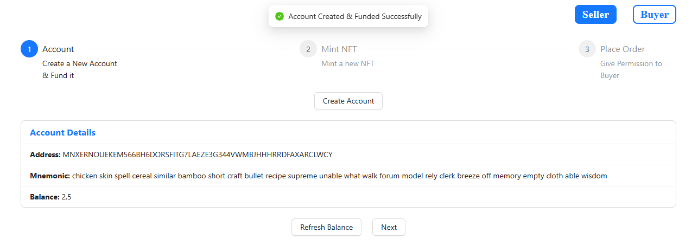
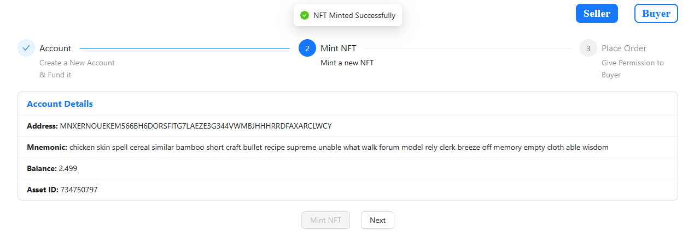
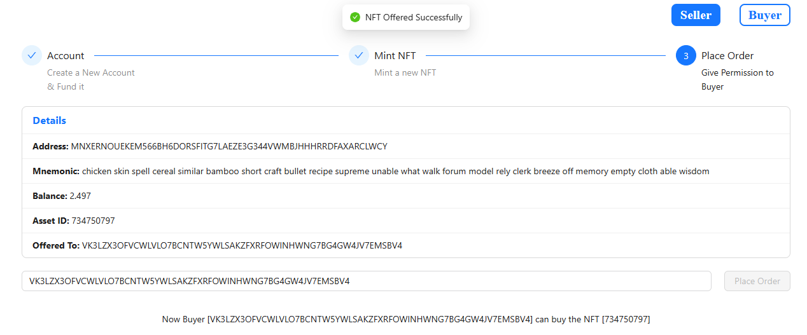
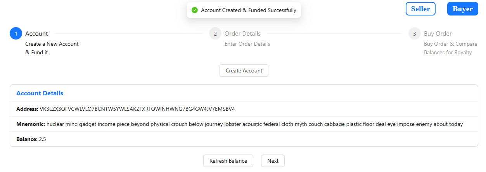
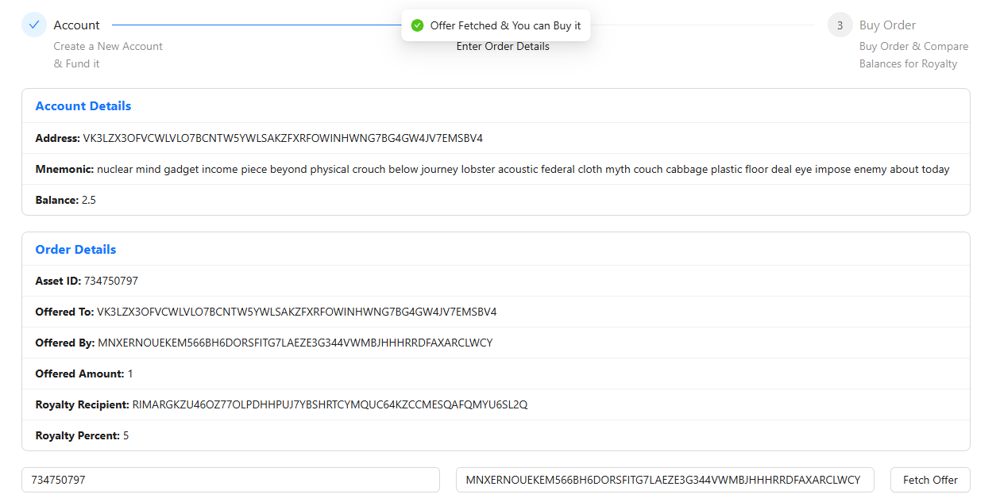
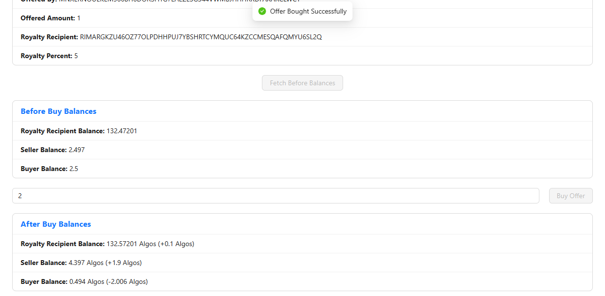

# ARC18 Frontend Implementation

This project provides a frontend interface for interacting with the ARC18 smart contract on Algorand, specifically focused on NFT trading with automatic royalty distribution.

Deployed at [Github Pages](https://satishgaxl.github.io/arc18-frontend/dist/)

## Overview

The frontend allows users to:
- Create and manage NFT sales as a seller
- Browse and purchase NFTs as a buyer
- Automatically handle royalty distributions during trades

## Prerequisites

- Node.js 
- Algorand testnet/mainnet access
- Access to ARC18 deployed contract

## Setup

1. Clone the repository
```bash
git clone https://github.com/SatishGAXL/arc18-frontend.git
cd arc18-frontend
```

2. Install dependencies:
```bash
npm install
```

3. Configure environment variables by copying `.env.sample` to `.env`:
```bash
cp .env.sample .env
```

4. Update `.env` with your credentials:
```properties
VITE_MASTER_WALLET_MNEMONIC="your_master_wallet_mnemonic"
VITE_ALGOD_TOKEN="your_algod_token"
VITE_ALGOD_URL="your_algod_url"
VITE_ALGOD_PORT=your_algod_port
VITE_ARC18_APP_ID=your_arc18_app_id
VITE_ARC18_APP_ADDRESS="your_arc18_app_address"
```

## User Flow

### Seller Perspective

1. **Account Creation**
   - Create new Algorand account
   - Account is automatically funded with test tokens
   - View account details and balance

   

2. **NFT Minting**
   - Mint a new NFT with ARC18 compliance
   - NFT is automatically created with clawback address set to ARC18 contract
   - View minted NFT details including Asset ID

   

3. **Order Placement**
   - Enter buyer's address to authorize NFT purchase
   - Place order by calling ARC18 contract
   - View order confirmation and details

   

### Buyer Perspective

1. **Account Creation**
   - Create new Algorand account
   - Account is automatically funded with test tokens
   - View account details and balance

   

2. **Order Details**
   - Enter Asset ID and seller's address
   - Fetch and verify offer details
   - View royalty information and payment requirements

   

3. **Purchase Process**
   - View pre-purchase balances of all parties
   - Enter payment amount
   - Execute purchase transaction
   - View post-purchase balances showing royalty distribution

   

## Features

- **Automated Account Creation**: One-click account creation with automatic funding
- **Real-time Balance Updates**: Track balances before and after transactions
- **Step-by-Step Interface**: Guided process for both buyers and sellers
- **Transaction Feedback**: Clear success/error messages for all operations
- **Balance Tracking**: Track changes in balances for seller, buyer, and royalty recipient

## Development

1. Start the development server:
```bash
npm run dev
```

2. Access the application at `http://localhost:5173`

## Architecture

The project is built using:
- React + TypeScript
- Vite as build tool
- Ant Design for UI components
- AlgoSDK for blockchain interactions

Key components:
- `Seller.tsx`: Handles seller-side operations
- `Buyer.tsx`: Handles buyer-side operations
- `Arc18Client.ts`: Interface for ARC18 smart contract interactions
- `config.ts`: Configuration and environment variable management

## Important Notes

- This implementation is designed for testnet use
- Ensure sufficient test tokens before performing transactions
- Store account mnemonics securely
- Test transactions with small amounts first
